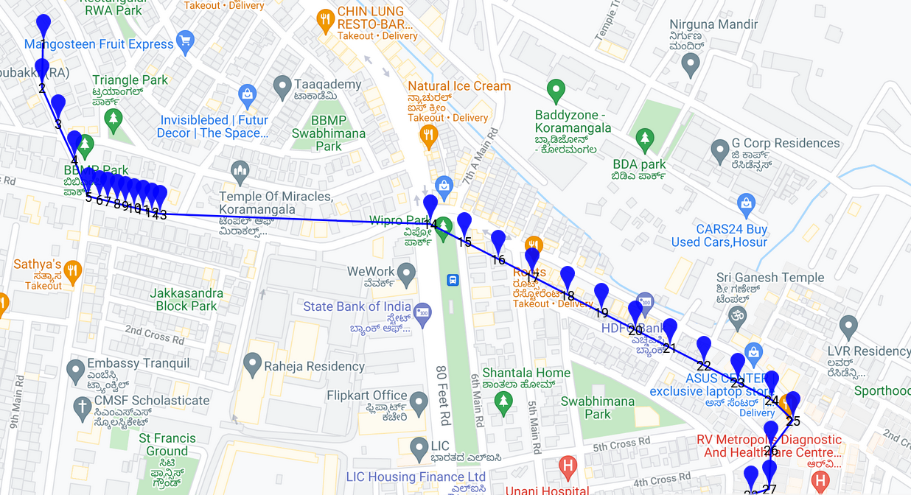

# cool-robot
Location Simulator

This is a simple Command Line Application That Plots the Path between two different Points (Lat+Long pairs) into Equidistant Points

E.g. Using Points [12.93175, 77.62872] and [12.92662, 77.63696]
Note: The last step might be shorter than 50 m

Assumptions:
1. Step Size (50 m) is constant
2. The elevation Difference is insignificant/ irrelevant
3. 
